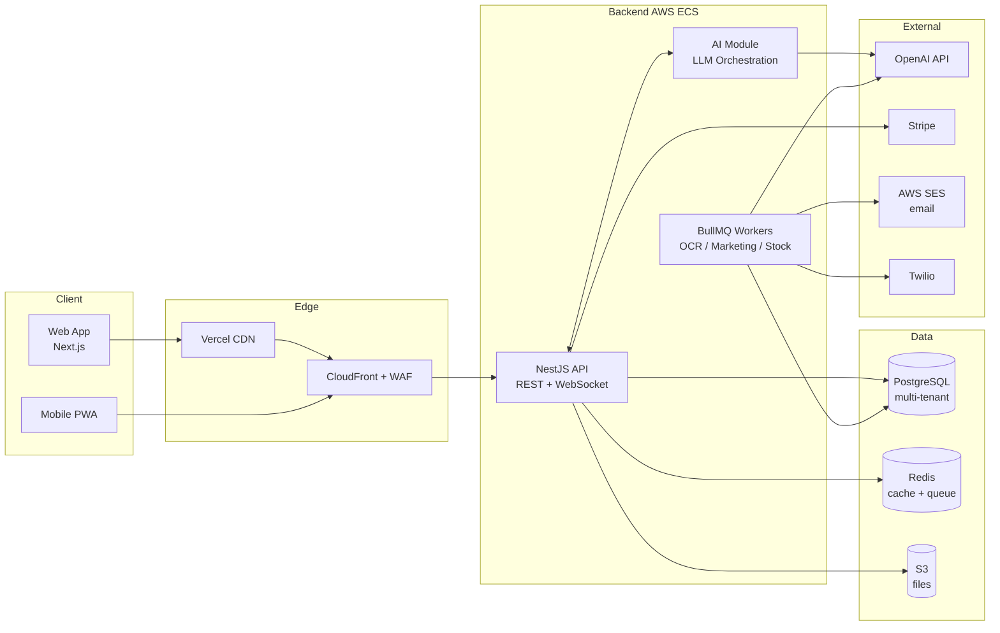
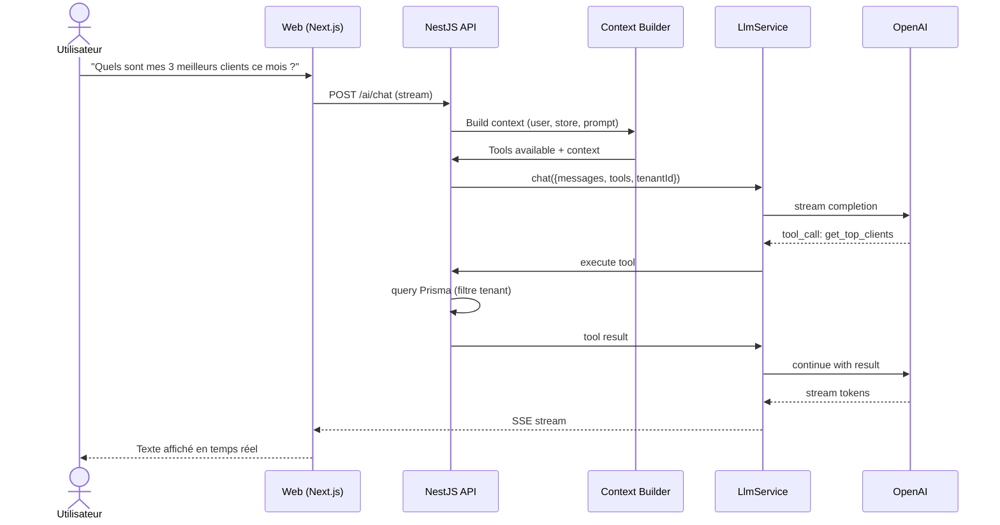
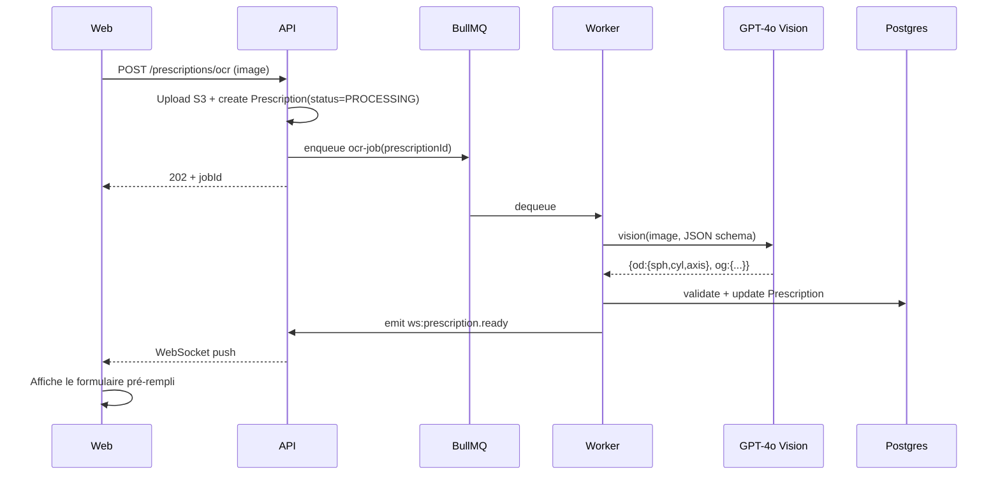

# 01 — Architecture globale OptiIA

## 1. Vue d'ensemble

OptiIA suit une architecture **modulaire monolithique** côté backend (NestJS) avec des **microservices logiques** isolés par module — l'IA étant le module le plus indépendant pour pouvoir être extrait en service séparé si besoin de scale horizontal.



## 2. Principes architecturaux

1. **Multi-tenant isolé par ligne** — chaque table métier porte un `tenantId` indexé. Un guard NestJS injecte automatiquement le filtre dans toutes les requêtes Prisma via un middleware. Pas de schéma par tenant (overhead trop fort à l'échelle).
2. **Hexagonal léger** — chaque module expose un controller (HTTP), un service (logique), et un repository (Prisma). Pas de pattern hexagonal complet pour ne pas alourdir, mais les services IA sont injectables et mockables.
3. **IA asynchrone par défaut** — toute tâche IA > 2 s passe par BullMQ. Le client reçoit un `jobId` et streame le résultat via WebSocket ou SSE.
4. **Idempotence** — toute mutation porte un `Idempotency-Key` header pour éviter les doublons (essentiel pour Stripe et les commandes fournisseurs auto).
5. **Pas de secrets dans le code** — AWS Secrets Manager + variables d'environnement chiffrées.

## 3. Découpage en modules NestJS

```
backend/src/
├── auth/                  Authentification + RBAC
├── tenants/               Gestion multi-boutiques
├── users/                 Utilisateurs (admin/opticien/employé)
├── clients/               CRM clients du magasin
├── prescriptions/         Ordonnances (manuel + OCR)
├── products/              Catalogue (montures, verres, accessoires)
├── stock/                 Inventaire + mouvements
├── sales/                 Devis → commandes → factures
├── appointments/          Agenda + rappels
├── ai/                    ⭐ Module IA central
│   ├── llm.service.ts     Wrapper OpenAI multi-provider
│   ├── quota.service.ts   Limitation par plan
│   └── services/          7 services métier IA
├── billing/               Stripe (abonnements)
├── notifications/         Email / SMS
├── analytics/             KPI dashboard
└── common/                Guards, decorators, filters
```

## 4. Modèle multi-tenant

### 4.1 Hiérarchie

```
Tenant (entreprise / franchise)
  ├── Stores (boutiques physiques) — ex: "Optique Lyon Bellecour"
  │     ├── Users (employés rattachés à une ou plusieurs boutiques)
  │     ├── Clients
  │     ├── Sales
  │     └── Stock
  └── Subscription (Stripe)
```

Un user peut appartenir à un seul `tenant` mais à plusieurs `stores`. Les rôles sont :
- **OWNER** — propriétaire du tenant, gère facturation et boutiques
- **ADMIN** — gère une boutique (employés, paramètres)
- **OPTICIAN** — opticien diplômé (peut valider ordonnances)
- **EMPLOYEE** — vendeur

### 4.2 Isolation

Toute requête métier traverse :
1. `JwtAuthGuard` → décode le token, injecte `req.user`
2. `TenantGuard` → vérifie que `user.tenantId` correspond à la ressource demandée
3. `RolesGuard` → vérifie le rôle requis (`@Roles('ADMIN')`)
4. `PrismaTenantMiddleware` → ajoute automatiquement `where: { tenantId }` à toutes les requêtes

### 4.3 Exemple de garde

```typescript
@Controller('clients')
@UseGuards(JwtAuthGuard, TenantGuard, RolesGuard)
export class ClientsController {
  @Post()
  @Roles('OWNER', 'ADMIN', 'OPTICIAN')
  create(@CurrentUser() user: AuthUser, @Body() dto: CreateClientDto) {
    return this.clientsService.create(user.tenantId, user.storeId, dto);
  }
}
```

## 5. Flux de données IA

### 5.1 Chat assistant (synchrone, streamé)



Points clés :
- Le LLM utilise **function calling / tools** pour interroger la BDD. Pas de texte brut "le LLM connaît les ventes" — chaque accès passe par une fonction typée et filtrée par tenant.
- Le contexte initial inclut : nom du magasin, plan d'abonnement, date du jour, rôle utilisateur, et un *summary card* des KPI courants (mis en cache 5 min).
- Stream via Server-Sent Events vers Next.js qui le pipe dans le composant chat.

### 5.2 OCR ordonnance (asynchrone)



## 6. Sécurité et conformité RGPD

| Mesure | Implémentation |
|---|---|
| Chiffrement at-rest | RDS + S3 : AES-256 (AWS managed keys) |
| Chiffrement in-transit | TLS 1.3 obligatoire, HSTS |
| Données santé | Les ordonnances sont des données de santé → champ `prescription.data` chiffré au niveau colonne (pgcrypto) avec clé par tenant dérivée d'une master key dans Secrets Manager |
| Consentement | Table `consents` (purposes : marketing, analytics, IA training-opt-out) |
| Droit à l'oubli | Soft-delete d'abord (90 j), puis purge cron + anonymisation des ventes (on garde les agrégats) |
| Export données | Endpoint `GET /tenants/me/export` → ZIP JSON (RGPD art. 20) |
| Logs IA | Table `ai_call_log` : pas de PII en clair, hashes des inputs ; opt-out training côté OpenAI activé via header `X-Anthropic-...` (équivalent OpenAI : `data_retention=zero`) |
| Audit trail | Toute action sensible (suppression client, modif ordonnance) loggée dans `audit_log` |
| Rate limiting | `@nestjs/throttler` global + custom par endpoint IA |
| Protection API | Helmet + CORS strict + JWT court (15 min) + refresh token (rotation) |

## 7. Scalabilité et déploiement

### 7.1 Capacités cibles (v1)

- 1 000 boutiques actives
- 50 utilisateurs concurrents par boutique en pic
- 10 000 appels IA / jour
- p95 API non-IA < 200 ms

### 7.2 Topologie AWS

```
Route 53
   │
CloudFront (statique)  →  Vercel (Next.js)
   │
ALB → ECS Fargate (NestJS, 2-10 tâches auto-scale CPU + custom metric : queue depth)
        │
        ├── RDS PostgreSQL (Multi-AZ, read replica pour analytics)
        ├── ElastiCache Redis (cluster mode pour BullMQ)
        ├── S3 (versionné, lifecycle 90j → Glacier)
        └── EventBridge → Lambda (cron : alertes stock, relances clients)
```

### 7.3 Stratégie de scale du module IA

- **Niveau 1** (v1) : module dans le monolithe, queue Redis dédiée, workers séparés.
- **Niveau 2** (si > 50k calls/j) : extraction en microservice Python/FastAPI pour bénéficier de l'écosystème IA (LangChain, embeddings locaux pour la recherche sémantique catalogue).
- **Niveau 3** : self-hosted models (Llama 3) pour les tâches simples (résumés courts, classification) avec routage intelligent : modèle local → fallback OpenAI si confiance faible.

## 8. Observabilité

- **Logs** : Pino + AWS CloudWatch, format JSON structuré, `traceId` propagé.
- **Métriques** : Prometheus exposé via `@willsoto/nestjs-prometheus`, dashboards Grafana.
- **Traces** : OpenTelemetry → AWS X-Ray. Spans dédiés sur chaque appel LLM (`ai.chat.completion`, attributs : `model`, `tokens_prompt`, `tokens_completion`, `cost_usd`, `tenantId`).
- **Alerting** : CloudWatch Alarms → PagerDuty pour : erreur 5xx > 1%, latence p95 > 1s, coût IA quotidien > seuil tenant, queue BullMQ > 1000 jobs.

## 9. Variables d'environnement

```bash
# Database
DATABASE_URL=postgresql://...

# Redis
REDIS_URL=redis://...

# Auth
JWT_ACCESS_SECRET=...
JWT_REFRESH_SECRET=...
JWT_ACCESS_TTL=15m
JWT_REFRESH_TTL=30d

# OpenAI
OPENAI_API_KEY=sk-...
OPENAI_DATA_RETENTION=zero
OPENAI_MODEL_DEFAULT=gpt-4o-mini
OPENAI_MODEL_ADVANCED=gpt-4o
OPENAI_MODEL_VISION=gpt-4o

# AI quotas (override per plan in DB)
AI_DEFAULT_MONTHLY_LIMIT_STARTER=100
AI_DEFAULT_MONTHLY_LIMIT_PRO=1000
AI_DEFAULT_MONTHLY_LIMIT_PREMIUM=10000
AI_HARD_DAILY_TENANT_USD=20

# Stripe
STRIPE_SECRET_KEY=...
STRIPE_WEBHOOK_SECRET=...

# AWS
AWS_REGION=eu-west-3
S3_BUCKET=optiia-prod
SES_FROM=noreply@optiia.io

# Twilio
TWILIO_ACCOUNT_SID=...
TWILIO_AUTH_TOKEN=...
TWILIO_FROM=+33...

# Encryption
TENANT_KEY_DERIVATION_SECRET=...   # Pour chiffrement colonnes santé
```
